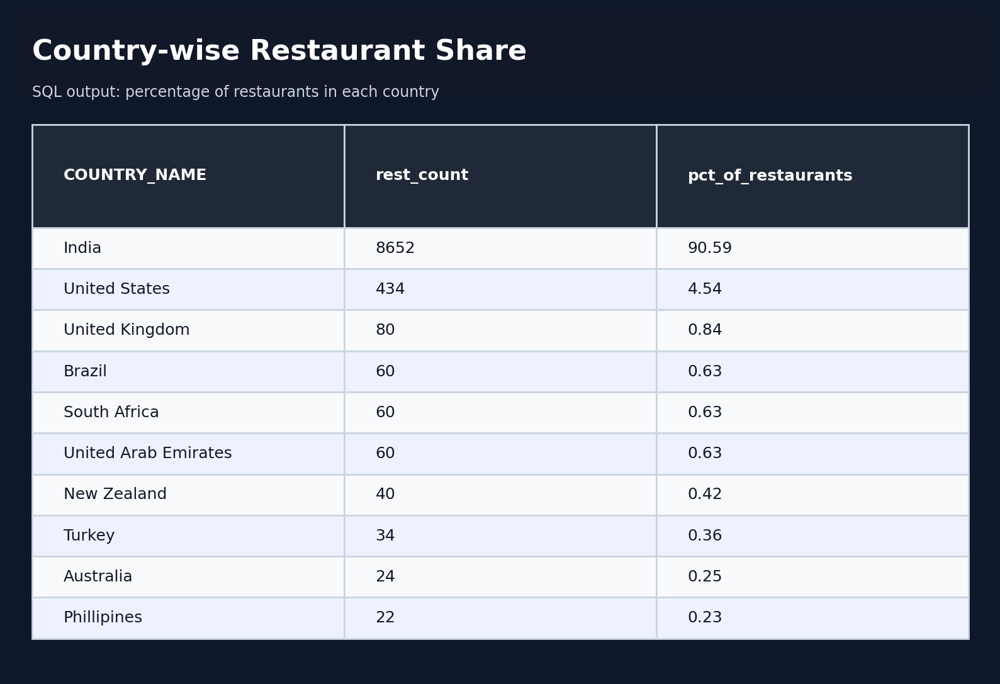
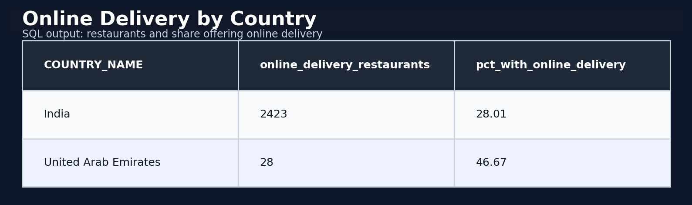
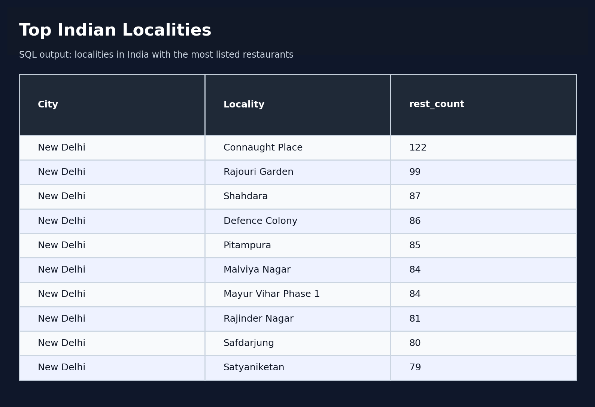
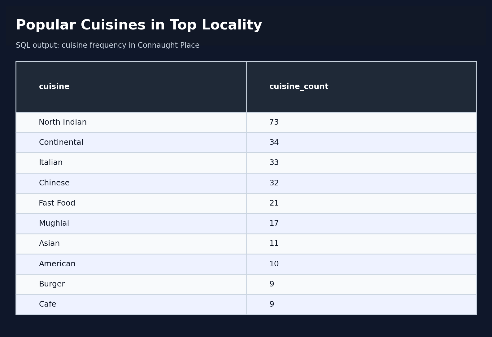
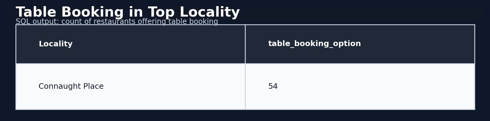
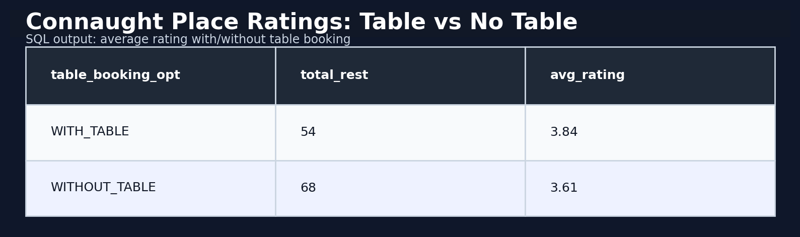
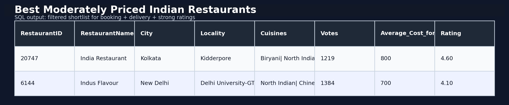

# Zomato Data Analysis Using SQL

This project analyzes the Zomato restaurant dataset using SQL queries focused on restaurant distribution, online delivery, locality trends, cuisines, table booking behavior, and highly rated moderately priced Indian restaurants.

## Project Objective

The goal of this project is to answer business-focused questions from the dataset using SQL only.

Key questions answered:
- Which country has the highest share of restaurants in the dataset?
- Which countries support online delivery?
- Which Indian localities have the highest number of restaurants?
- What are the most popular cuisines in Connaught Place?
- How many restaurants in the top locality support table booking?
- Do restaurants with table booking have better ratings?
- Which moderately priced Indian restaurants are the best options?

## Dataset

- Source file used: `zomato_dataset.csv`
- The analysis is based on the uploaded Zomato dataset.
- A country lookup mapping was recreated to support country-level analysis.

## Files Included

- `all_queries.sql` — all SQL queries in one file
- `sql/` — individual SQL files for each analysis question
- `screenshots/` — screenshots of SQL query outputs
- `query_explanations.md` — short explanation of each query and output

## SQL Analysis Performed

### 1. Country-wise restaurant percentage
Finds the percentage contribution of each country in the dataset.

### 2. Countries with online delivery
Shows which countries have restaurants offering online delivery.

### 3. Top Indian localities by restaurant count
Identifies the busiest localities in India based on number of restaurants.

### 4. Most popular cuisines in Connaught Place
Breaks down cuisine tags to show the most frequent cuisines in the top locality.

### 5. Table booking availability in top locality
Counts restaurants in Connaught Place that support table booking.

### 6. Ratings comparison: table booking vs no table booking
Compares average ratings of restaurants with and without table booking in Connaught Place.

### 7. Best moderately priced Indian restaurants
Lists the highest rated Indian restaurants with moderate pricing.

## Screenshots

### Country Percentage

### Online Delivery by Country

### Top Indian Localities

### Popular Cuisines in Connaught Place

### Table Booking in Top Locality

### Ratings: Table Booking vs No Table Booking

### Best Moderately Priced Indian Restaurants

## Key Insights

- India contributes the vast majority of restaurants in this dataset.
- Online delivery is available in only a limited set of countries in this data.
- Connaught Place, New Delhi appears as the leading Indian locality by restaurant count.
- North Indian cuisine appears most frequently in the top locality.
- Restaurants with table booking show stronger average ratings than those without in Connaught Place.

## Tools Used

- SQL
- CSV dataset
- GitHub for project hosting

## How to Add This to GitHub

1. Create a new GitHub repository.
2. Upload all files from this project folder.
3. Keep `README.md` in the root of the repository.
4. Make sure the `screenshots/` folder is uploaded so images render correctly in GitHub.

## Resume Project Title Suggestion

**Zomato Data Analysis Using SQL**

## Resume Bullet Suggestions

- Analyzed Zomato restaurant data using SQL to uncover country-level distribution, top-performing localities, cuisine popularity, and booking behavior.
- Wrote analytical SQL queries using filtering, grouping, aggregation, and sorting to derive business insights from restaurant data.
- Identified patterns in online delivery support, table booking impact on ratings, and moderately priced high-rated Indian restaurants.
